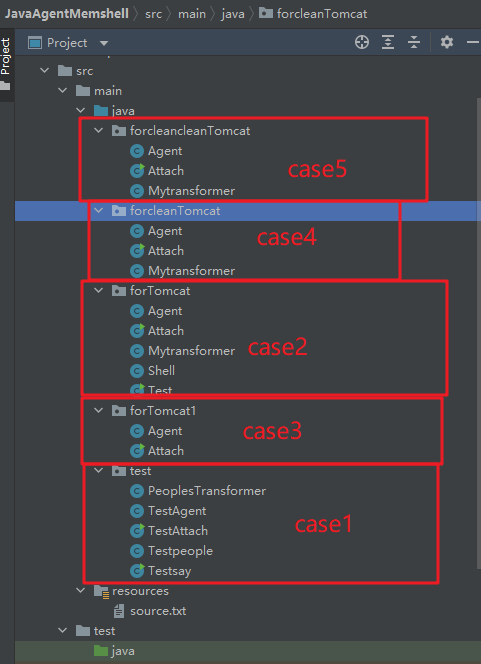
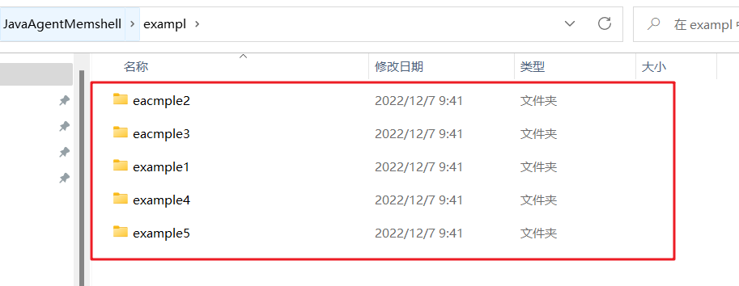
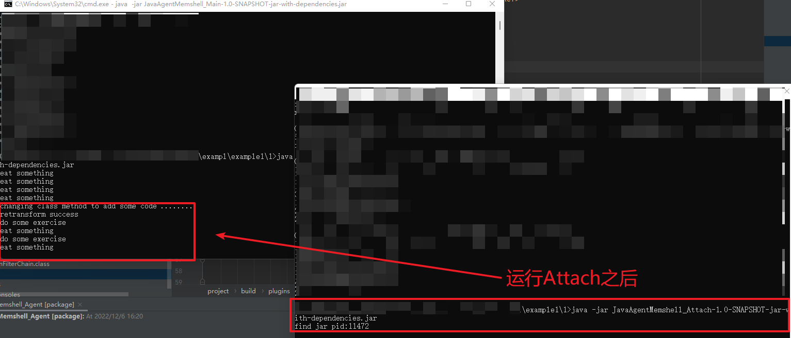

# Javaagent内存马demo，以及检测和修复demo

5个case及源码:

example目录下的5个example分别对应的5个case：

## Case1

一个Javaajent agentmain使用的demo，运行时修改代码逻辑

## Case2

一个针对Tomcat（笔者测试使用的tomcat版本是8.5.45，下面都是这版本）里面的org.apache.catalina.core.ApplicationFilterChain类internalDoFilter方法字节码javaagent retransformClasses的内存马实现demo

## Case3

一个针对Tomcat里面的org.apache.catalina.core.ApplicationFilterChain类internalDoFilter方法字节码javaagent redefineClasses的内存马实现demo

## Case4  检测

一个能**检测**Tomcat里面的org.apache.catalina.core.ApplicationFilterChain类internalDoFilter方法字节码被javaagent retransformClasses修改造成内存马的demo。

运行之后，将该类被修改后的字节码写到tomcat服务bin目录下生成classfilebuffer.class

通过反编译这个class，检测其是否被注入了webshell逻辑。

除此之外这个demo，其实也可以修复ApplicationFilterChain类被javaagent redefineClasses修改造成内存马。（误打误撞，但是不能检测）

## Case5 修复

一个可以**修复**Tomcat里面的org.apache.catalina.core.ApplicationFilterChain类internalDoFilter方法字节码被javaagent retransformClasses修改造成内存马的demo。

## 其他：

对于javaagent里面redefineClasses实现的内存马，检测的思路可以从jdk里面的sa-jdi.jar来下手，通过这个工具可以获取见到被redefineClasses重定义的类的字节码。修复的话没啥好说的，和retransformClasses一样，直接通过javassist技术获取到磁盘上原始的字节码，返回即可，就实现了修复。